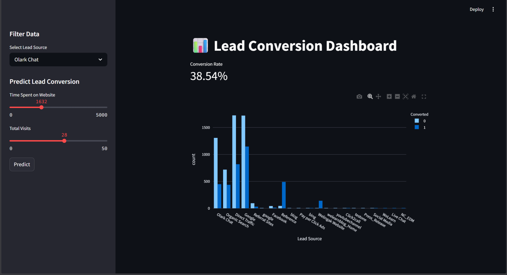
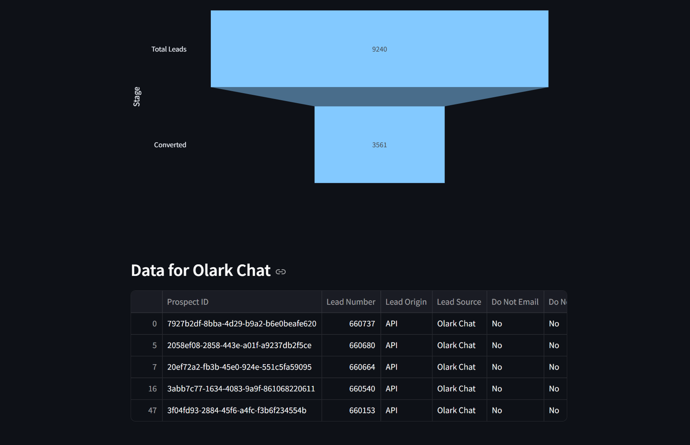
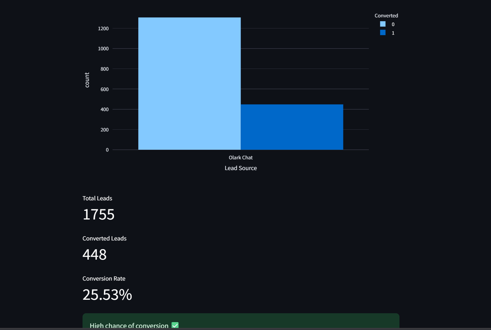

# 💼 Lead Conversion Intelligence Dashboard

An end-to-end **Business Development Analytics & Lead Scoring System** built using real-world data to help sales teams prioritize high-quality leads and improve conversion rates.

---

## 🚀 Project Overview

In modern business development, organizations generate a large volume of leads but often lack clarity on:

* Which leads are most likely to convert
* Where drop-offs occur in the funnel
* Which channels drive high-quality leads

This project solves these challenges by combining **data analytics, machine learning, and interactive visualization**.

---

## 🎯 Objectives

* Analyze lead behavior and engagement patterns
* Identify key factors influencing conversion
* Build a predictive model to score leads
* Develop an interactive dashboard for decision-making

---

## 📊 Features

### 🔹 1. Business Analytics Dashboard

* Conversion rate tracking
* Total leads vs converted leads
* Source-wise performance analysis

### 🔹 2. Funnel Analysis

* Visual representation of lead journey
* Identifies drop-off stages

### 🔹 3. Lead Conversion Prediction

* Predicts whether a lead will convert
* Based on behavioral features like:

  * Time spent on website
  * Number of visits

### 🔹 4. Interactive Filters

* Filter data by lead source
* Dynamic visualization updates

---

## 🧠 Machine Learning Model

* **Algorithm Used:** Random Forest Classifier
* **Type:** Classification
* **Goal:** Predict lead conversion (0 or 1)

### 🔍 Key Features Used:

* Total Time Spent on Website
* Total Visits

### 📈 Output:

* Binary prediction (Converted / Not Converted)
* Can be extended to probability-based scoring

---

## 🛠️ Tech Stack

| Technology           | Purpose                      |
| -------------------- | ---------------------------- |
| Python               | Core programming             |
| Pandas               | Data cleaning & manipulation |
| NumPy                | Numerical operations         |
| Matplotlib / Seaborn | Data visualization           |
| Plotly               | Interactive charts           |
| Scikit-learn         | Machine learning model       |
| Streamlit            | Dashboard development        |
| Joblib               | Model serialization          |

---

## 📁 Project Structure

```
lead-conversion-intelligence/
│
├── app/
│   └── dashboard.py
│
├── model/
│   └── model.pkl
│
├── notebooks/
│   └── eda_model.ipynb
│
├── requirements.txt
├── README.md
```

---

## ⚙️ Installation & Setup

### 1️⃣ Clone the repository

```
git clone https://github.com/ShankarGaneshD/Lead-conversion-intelligence.git
cd Lead-conversion-intelligence
```

---

### 2️⃣ Install dependencies

```
pip install -r requirements.txt
```

---

### 3️⃣ Run the application

```
streamlit run app/dashboard.py
```

---

## 📸 Dashboard Preview

## 📸 Dashboard Preview

### 🔹 Main Dashboard


### 🔹 Funnel Analysis


### 🔹 Lead Data View


---

## 💼 Business Impact

* Helps sales teams focus on high-quality leads
* Improves conversion efficiency
* Reduces time spent on low-potential prospects
* Enables data-driven decision-making

---

## 🧠 Key Learnings

* Importance of feature selection in ML models
* Handling real-world data inconsistencies
* Deploying ML models into interactive applications
* Translating data insights into business value

---

## 🚀 Future Enhancements

* Add probability-based lead scoring
* Integrate more behavioral and demographic features
* Deploy the dashboard online (Streamlit Cloud)
* Automate data pipeline

---

## 👤 Author

Shankar Ganesh D

* GitHub: https://github.com/ShankarGaneshD

---

## ⭐ If you found this project useful, consider giving it a star!
